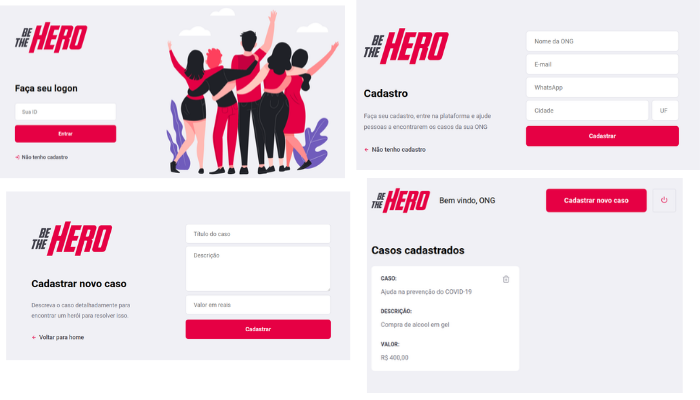
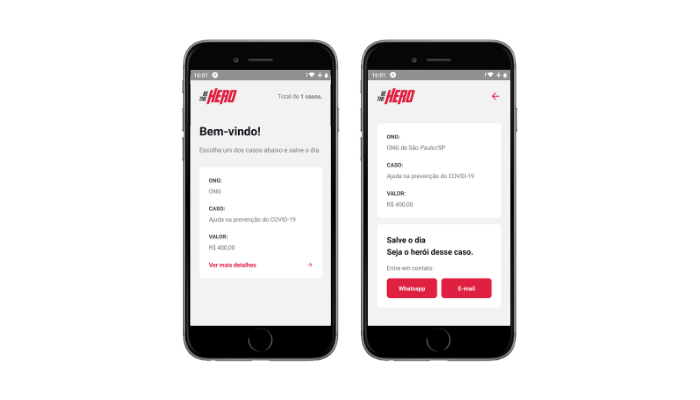

# 

> Projeto desenvolvido na **Semana Omnistack 11.0** ministrada pela **Rocketseat**.


<a href="https://www.linkedin.com/in/rodrigo-yoshioka" target="_blank" >

</a>
<a href="mailto:rodrigo.yoshioka@gmail.com" target="_blank" >

</a>

"_Seja um herói e ajude uma entidade de caridade ou cadastre sua ONG para receber doações_"

## Sobre o projeto

A idéia é conectar ONGs com doadores.
O projeto consiste em duas versões, uma acessada via navegador e outra via aplicativo de celular.

Na versão por navegador web, a ONG pode se cadastrar, se logar e criar incidencias.
Já na versão mobile, o doador lista as incidencias e efetua a doação, que é notificada via email ou msg de whatsapp para a ONG.

Para conectar as duas versões existe um backend que cuida das transações das informações.





## Tecnologias utilizadas

Este projeto foi desenvolvido com as seguintes tecnologias:

- [Node.js](https://nodejs.org/en/)
- [Expo](https://expo.io/)
- [Express](https://expressjs.com/pt-br/)
- [ExpressJs](https://expressjs.com/pt-br/)
- [Nodemon](https://www.npmjs.com/package/nodemon)
- [Axios](https://www.npmjs.com/package/axios)
- [Cors](https://www.npmjs.com/package/cors)
- [Eslint](https://www.npmjs.com/package/eslint)
- [Jest](https://www.npmjs.com/package/jest)

## Instalação

#### Backend

```sh
cd backend
npm install
npx knex migrate:latest
```

#### Frontend

```sh
cd frontend
npm install
```

#### Mobile

```sh
cd mobile
npm install
```

## Utilização

#### Backend

```sh
cd backend
npm start
```

#### Frontend

```sh
cd frontend
npm start
```

#### Mobile

```sh
cd mobile
npm start
```
